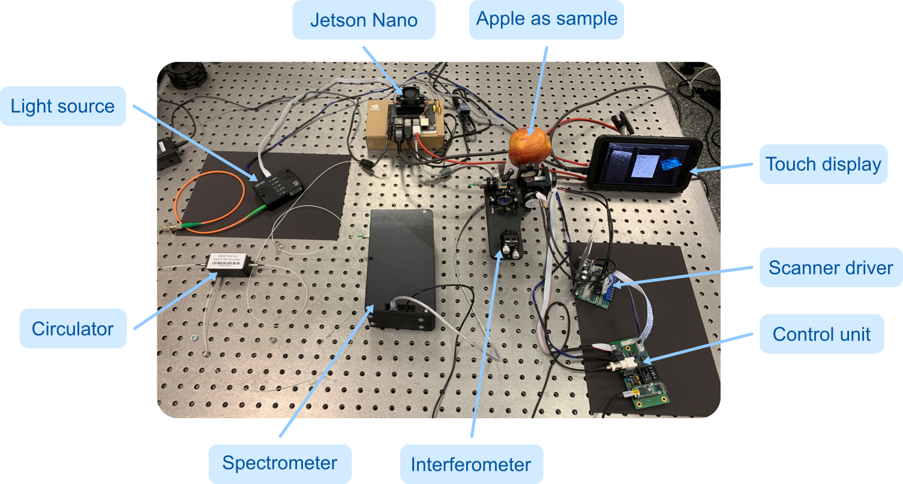

 #  PhytoOCT - Hardware 

There are multiple ways to build an OCT system. In this picture, you can see the main components of our portable system:

  

General Info
--------
There are various hardware configurations that are possible for a working OCT system. However, if you wish to use the code from this repository without modifications, you will need a Jetson Nano, the USB line camera 8M from Coptonix, and an Arduino board. The code, in its current state, is developed specifically for these components. All other components can be chosen freely, as the optical components, the display or the galvo scanners do not depend significantly on the code.

Feel free to contact me if you have any suggestions for improvement. [>Contact info<](https://www.hot.uni-hannover.de/en/about-the-hot/team/personen-detailansicht/hannover-centre-for-optical-technologies-hot-45ht8/research-staff-1/miroslav-zabic?tx_t3luhepv_t3luhepvoe%5BdisablePersHomepages%5D=0&cHash=a7cb592675187dbe0eb773ea7ece05e2)

Componentlist and possible suppliers
--------

| Module         | Component              | Possible Suppliers  |
|----------------|------------------------|---------------------|
| Spectrometer   | Line camera            | [USB Line Camera 8 M S15739-1024 from Coptonix](https://coptonix.com/products/usb-line-camera-8m/)   |
|                | Transmission grating   |[Wasatch Photonics](https://wasatchphotonics.com/product-category/gratings-and-diffractive-optics/gratings-for-oct/), [LightSmyth](https://www.maxlevy.com/category/TransGrat.html), ...|
|                | Optics and optomechanics            | [Thorlabs](https://www.thorlabs.com/), [Edmund Optics](https://www.edmundoptics.com/), [OptoSigma](https://www.optosigma.com), [Qioptiq](https://www.qioptiq-shop.com/), [Newport](https://www.newport.com), ...          |
|----------------|----------------|----------------|
| Optical OCT setup | Light source (SLD)  | [Superlum](https://www.superlumdiodes.com/), [Exalos](https://www.exalos.com/), [Inphenix](https://www.inphenix.com), ...         |
|  | Circulator          | [AMS Techonologies](https://www.amstechnologies-webshop.com/), [Nano-Giga](http://www.nano-giga.fr), [OF-Link](https://www.of-link.com), ...         |
|  | Galvo scanner            | *Supplier needed - Please contact me if you have any suggestions*         |
|  | Optics and optomechanics            | [Thorlabs](https://www.thorlabs.com/), [Edmund Optics](https://www.edmundoptics.com/), [OptoSigma](https://www.optosigma.com), [Qioptiq](https://www.qioptiq-shop.com/), [Newport](https://www.newport.com), ...          |
|----------------|----------------|----------------|
| Electronics | Computer  | [NVIDIA Jetson Nano 4 GB](https://developer.nvidia.com/embedded/jetson-nano-developer-kit) |
|  | Custom PCB          | Many different providers available         | 
|  | Display            | Many different providers available         |
|  | Powerbank           | Many different providers available          |

