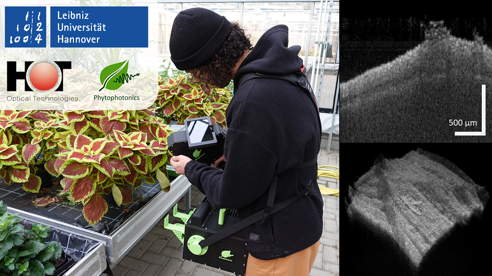

 #  PhytoOCT 

PhytoOCT is a portable and low-cost Optical Coherence Tomography (OCT) system designed (but not limited) for applications in plant science.

<p align="center">
  
</p>

This repository contains the code for the [OCTproZ](https://github.com/spectralcode/OCTproZ) plugin designed for PhytoOCT, along with the Arduino board code that generates the scan signal for the galvo scanners and synchronizes the spectrometer with the galvo scanner.


Hardware
--------
Information about the hardware setup can be found [here](docs/hardware.md).


Publication
----------
[Development of a portable and low-cost OCT system for horticultural research](https://www.repo.uni-hannover.de/handle/123456789/16675)

BibTeX:
```
@inproceedings{10.1117/12.3001407,
author = {Miroslav Zabic and Mohamad Bsata and Akshay Solleti and Timm Landes and Hans Bethge and Dag Heinemann},
title = {{Development of a portable and low-cost OCT system for horticultural research}},
volume = {12879},
booktitle = {Photonic Technologies in Plant and Agricultural Science},
editor = {Dag Heinemann and Gerrit Polder},
organization = {International Society for Optics and Photonics},
publisher = {SPIE},
pages = {1287904},
keywords = {OCT, optical coherence tomography, low-cost, portable, phytophotonics},
year = {2024},
doi = {10.1117/12.3001407},
URL = {https://doi.org/10.1117/12.3001407}
}
```


License
----------
PhytoOCT is licensed under [GPLv3](LICENSE).</br>